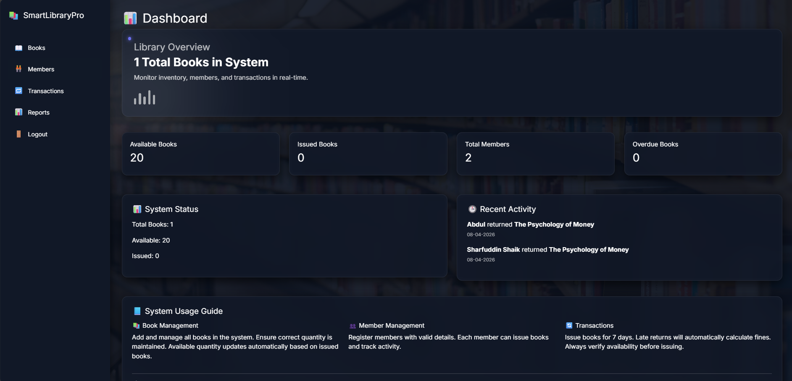
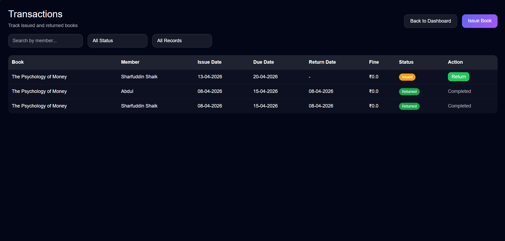

# 📚 Smart Library Pro
A web-based application to manage library books, members, and issue/return transactions with fine tracking.


## Description
Smart Library Pro is a web application designed to streamline library operations. It handles book inventory management by tracking titles, authors, categories, quantities, and available stock. The system maintains member records with personal details and registration dates. It also manages issue and return transactions, monitors due dates, and automatically calculates fines for overdue books.

## 💡 Why This Project?
It solves the everyday need for a simple library system that keeps track of available stock, member registrations, and borrowed books with due dates and fines.

## Features
- Book management with create, edit, delete, and detail pages
- Book image upload and available quantity tracking
- Member management with create, edit, delete, and details
- Issue book flow with member selection and stock reduction
- Return book flow with due date checking and fine calculation
- Overdue transaction listing
- Dashboard and report pages showing totals and recent activity
- SQLite database persistence using Entity Framework Core

## 📸 Screenshots





## Tech Stack
- Backend: ASP.NET Core, C#
- Database: SQLite
- ORM: Entity Framework Core
- Frontend: HTML, CSS, Bootstrap, JavaScript
- Tools: .NET SDK, NuGet

## Project Structure
```plaintext
SmartLibraryPro/
├── appsettings.Development.json
├── appsettings.json
├── bin/
├── Controllers/
│   ├── AuthController.cs
│   ├── BookController.cs
│   ├── DashboardController.cs
│   ├── HomeController.cs
│   ├── MemberController.cs
│   ├── ReportController.cs
│   └── TransactionController.cs
├── Data/
│   └── ApplicationDbContext.cs
├── library.db
├── Migrations/
├── Models/
│   ├── Book.cs
│   ├── ErrorViewModel.cs
│   ├── Member.cs
│   └── Transaction.cs
├── obj/
├── Program.cs
├── Properties/
├── README.md
├── screenshots/
├── SmartLibraryPro.csproj
├── SmartLibraryPro.sln
├── ViewModels/
├── Views/
│   ├── _ViewImports.cshtml
│   ├── _ViewStart.cshtml
│   ├── Auth/
│   │   └── Login.cshtml
│   ├── Book/
│   │   ├── Create.cshtml
│   │   ├── Details.cshtml
│   │   ├── Edit.cshtml
│   │   └── Index.cshtml
│   ├── Dashboard/
│   │   └── Index.cshtml
│   ├── Home/
│   │   └── Welcome.cshtml
│   ├── Member/
│   │   ├── Create.cshtml
│   │   ├── Details.cshtml
│   │   ├── Edit.cshtml
│   │   └── Index.cshtml
│   ├── Report/
│   │   ├── Details.cshtml
│   │   └── Index.cshtml
│   ├── Shared/
│   │   ├── _Layout.cshtml
│   │   ├── _Layout.cshtml.css
│   │   └── _ValidationScriptsPartial.cshtml
│   └── Transaction/
│       ├── Details.cshtml
│       ├── Index.cshtml
│       ├── Issue.cshtml
│       ├── Overdue.cshtml
│       └── Return.cshtml
└── wwwroot/
    ├── css/
    ├── images/
    ├── js/
    └── lib/
```

## Modules / Roles
- No dedicated user roles are implemented
- The app currently provides a single management interface for library operations

## How to Run
```bash
git clone https://github.com/sharfuh/smart-library-pro.git
dotnet restore
dotnet build
dotnet run
```

Frontend: http://localhost:<port> (e.g., http://localhost:5159)
Swagger: Not configured in this project

## 🚀 Key Learnings
- Building CRUD workflows in ASP.NET Core MVC
- Using Entity Framework Core with SQLite
- Implementing file uploads for book images
- Managing related data with navigation properties
- Calculating due dates, overdue status, and fines

## Future Enhancements
- Add authentication and role-based access control
- Add search and filtering for books and members
- Support export of reports to PDF or Excel
- Add pagination for large book and transaction lists
- Improve fine management and payment tracking
